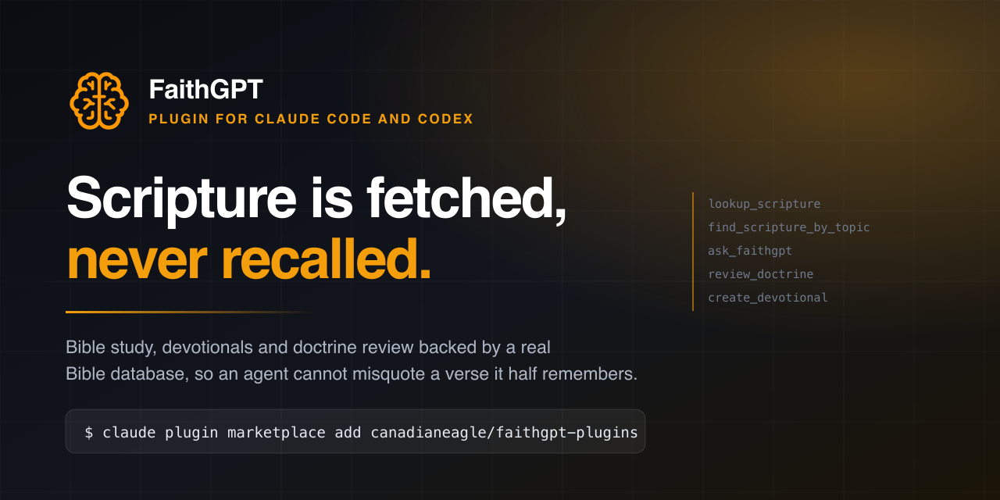

<p>
  <a href="https://github.com/canadianeagle/faithgpt-plugins/actions/workflows/test.yml"></a>
  
  
  
  
</p>

# FaithGPT

Bible study, devotionals and doctrine review inside Claude Code and Codex, backed by a real Bible database.

```bash
claude plugin marketplace add canadianeagle/faithgpt-plugins
claude plugin install faithgpt@faithgpt
```

```bash
codex plugin marketplace add canadianeagle/faithgpt-plugins
codex plugin add faithgpt@faithgpt
```

Your first tool call opens the FaithGPT consent screen. A free account works.

## Why this exists

Ask any model for John 3:16 and it will answer instantly, confidently, and in wording that matches no translation ever printed. It blends a few it has seen. Most of the time nobody notices, because the gist is right and the verse is familiar.

That is the failure this plugin is built around. A misquoted verse carries the authority of Scripture while saying something Scripture does not say, and a reader has no way to tell. The famous verses are the worst offenders, because familiarity is exactly what stops an agent from checking.

So the plugin has one rule underneath everything else: **Scripture is fetched, never recalled.** Before any verse text reaches you, a file, or a commit, it comes out of the database with its reference and translation attached.

## What you get

Seven skills, invokable as slash commands on both platforms:

| Skill | What it does |
| --- | --- |
| `/verse` | Look up a passage and return its exact text |
| `/study` | Work a passage through context, structure, cross-references and application |
| `/devotional` | Write a Scripture-rooted devotional or a prayer |
| `/doctrine-check` | Review a sermon, article or claim for doctrinal soundness |
| `/verify-scripture` | Find every Bible reference in a file or directory and check each quotation |
| `/sermon-prep` | Build a sermon outline from a passage or a theme |
| `scripture-integrity` | Fires on its own whenever a verse is about to be quoted |

`scripture-integrity` is the one that matters. You never invoke it. It routes every quotation through a real lookup and refuses translations FaithGPT does not hold.

**An agent** called `scripture-verifier` checks every quotation across a set of files and reports misquotes, wrong translation labels, and references that do not exist. Point it at a content directory or a Bible app's seed data.

**Five tools** from `https://api.faithgpt.io/mcp`: `lookup_scripture`, `find_scripture_by_topic`, `ask_faithgpt`, `review_doctrine`, `create_devotional`. None of them publishes or modifies anything outside your FaithGPT account.

## Translations

`KJV`, `ASV` and `YLT`. All public domain.

Ask for the NIV and the plugin will tell you it does not have it rather than producing something close. That is deliberate. Reciting a copyrighted translation from memory is both a licensing problem and the same fabrication problem in a different coat, and what comes out is usually a blend that matches no edition at all.

## Verifying Scripture across a repository

The reference detector runs offline, with no dependencies and no network:

```bash
node scripts/detect-scripture-refs.mjs content/
node scripts/detect-scripture-refs.mjs devotional.md --json
```

It only matches references that lead with a book name. `16:9`, `PR 42` and `this is 1:1 mapping` are left alone, which took removing 35 two-letter abbreviations that collide with ordinary English. An early build read `is 1:1` as Isaiah.

Then `/verify-scripture` has the agent check the wording of everything it found, and reports one of four outcomes per reference: match, wrong translation, misquote, or bad reference.

```
content/devotionals/hope.md:22 — Misquote.
  Quoted as "God helps those who help themselves" and attributed to Proverbs 28:26.
  That sentence is not in the Bible. Proverbs 28:26 (KJV) reads:
  "He that trusteth in his own heart is a fool: but whoso walketh wisely,
   he shall be delivered."
```

## Who it is for

Pastors and teachers preparing to preach. Writers producing devotionals or study material who cannot afford a wrong quotation in print. Small group leaders. Theology students. Developers building Bible apps, who need seed data checked before it ships. Anyone who wants an agent that admits when it does not know a verse.

## Configuration

| Option | Default | What it does |
| --- | --- | --- |
| `default_translation` | `KJV` | Translation used when you do not name one |
| `verify_scripture_on_write` | `false` | After a file is written, list any Bible references so the agent verifies them |

Run `/plugin configure faithgpt@faithgpt` in Claude Code.

The write hook stays off until you turn it on, exits without failing a write on every path, and stays silent when a file has no references in it.

## Already using the FaithGPT connector?

If you added the connector from the Claude directory or with `claude mcp add`, you already have the five tools. The plugin adds the skills, the agent, the hook and the offline detector on top.

It registers its MCP server as `bible` rather than `faithgpt` on purpose. A user scoped server named `faithgpt` shadows a plugin server sharing that name, which would silently hide the tools from exactly the people who adopted the connector first.

## How it fits together

```
your prompt
   │
   ├─ scripture-integrity ──── decides which tool, refuses unheld translations
   │
   ├─ skills ───────────────── verse · study · devotional · doctrine-check
   │                           verify-scripture · sermon-prep
   │
   ├─ scripture-verifier ───── bulk checking across files (subagent)
   │
   ├─ detect-scripture-refs ── offline, no network, no dependencies
   │
   └─ MCP: bible ───────────── api.faithgpt.io/mcp, OAuth 2.0 + PKCE
```

## Development

```bash
node faithgpt/tests/detect-scripture-refs.test.mjs   # 28 detector assertions
claude plugin validate . --strict                    # marketplace and plugin
```

The detector tests are mostly false positives on purpose. A detector that flags `this is 1:1 mapping` makes the write hook noise, and noise gets switched off.

## Questions people ask

**Does this need a paid FaithGPT account?** No. A free account works, and the read only tools are cheap.

**Does it work offline?** The reference detector does. Looking up verse text needs the API.

**Can it add verses to my own app's database?** It reads. No tool writes anything outside your FaithGPT account.

**Which Bible translation does it default to?** KJV, changeable in config to ASV or YLT.

**Does it work in Cursor, Windsurf or another MCP client?** The five tools do, by adding `https://api.faithgpt.io/mcp` as an MCP server. The skills, agent and hook need Claude Code or Codex.

**Is it affiliated with Anthropic or OpenAI?** No. FaithGPT is built by FAITHGPT AI INC.

## Links

- [Documentation](https://www.faithgpt.io/api/mcp/)
- [FaithGPT](https://www.faithgpt.io)
- [Claude connector listing](https://claude.ai/directory/faithgpt)
- [Support](https://www.faithgpt.io/contact) · [Privacy](https://www.faithgpt.io/privacy) · [Terms](https://www.faithgpt.io/terms)

MIT licensed. Copyright FAITHGPT AI INC.
